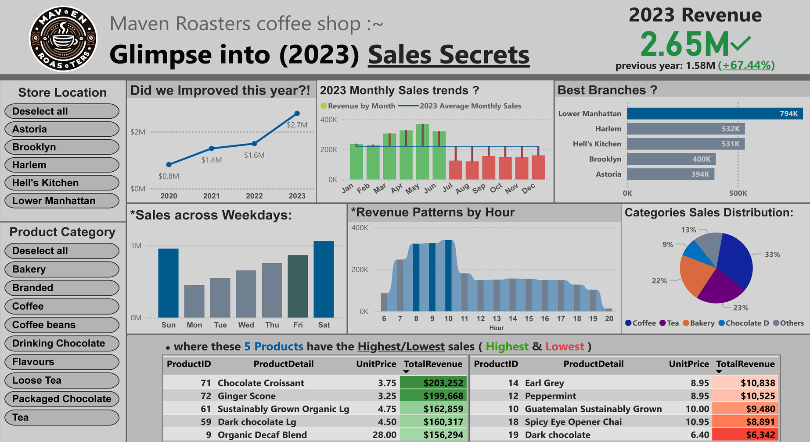

# Maven Roasters 2023 Sales Analysis Report
- **Author:** Maher Mahmoud Maher
- **Date:** 29/09/2024 
- **Used Augmented-Dataset Link:**  [https://www.mediafire.com/file/m4vj72hiyhnpl8e/augmented_coffee_shop_sales.csv](https://www.mediafire.com/file/m4vj72hiyhnpl8e/augmented_coffee_shop_sales.csv)

## Table of Contents
- [Maven Roasters 2023 Sales Analysis Report](#maven-roasters-2023-sales-analysis-report)
  - [Table of Contents](#table-of-contents)
  - [Introduction](#introduction)
  - [Executive Summary](#executive-summary)
    - [Key Findings](#key-findings)
  - [Data Description](#data-description)
  - [Exploratory Data Analysis (EDA)](#exploratory-data-analysis-eda)
    - [Sales Trends and Patterns](#sales-trends-and-patterns)
  - [Results](#results)
  - [Discussion](#discussion)
  - [Conclusion](#conclusion)
  - [Recommendations](#recommendations)
  - [About the Analyst](#about-the-analyst)
  - [Thank you](#thank-you)

## Introduction
This report presents the results of a sales analysis performed on Maven Roasters, a premium coffee shop chain with five locations in New York City. The purpose of this analysis was to maximize revenue by performing a comprehensive analysis of sales trends and patterns. The analysis involved data augmentation, transforming the dataset into a star schema, and using Power BI and Power Query for data manipulation and visualization.

## Executive Summary
The analysis revealed several key insights related to the sales performance of Maven Roasters. Yearly growth, seasonal trends, location performance, and product mix were among the primary areas of focus.

### Key Findings
1. **Yearly Growth:** Revenue increased by 67.44% from 2022 to 2023, reaching $2.65M.
2. **Seasonal Trends:** Sales peak during spring and early summer (March to June), with a noticeable decline in the latter half of the year.
3. **Location Performance:** Lower Manhattan is the best-performing branch, followed by Harlem and Hell's Kitchen.
4. **Daily Patterns:** Saturday and Sunday are the busiest days, with a midweek dip.
5. **Hourly Trends:** Peak hours are between 7 AM and 11 AM, with a sharp decline after noon.
6. **Product Mix:** Coffee (33%) and tea (23%) are the top-selling categories, followed by bakery items (22%).
7. **Best-selling Items:** Chocolate Croissant and Ginger Scone are top revenue generators.

## Data Description
**Data Source:**  
The original dataset consisted of 140,000 records covering a 6-month period. Data augmentation was performed to expand the dataset to over 1 million records, covering full 4 years from 01/01/2020 to 31/12/2023.

**Used Augmented-Dataset Link:**  [https://www.mediafire.com/file/m4vj72hiyhnpl8e/augmented_coffee_shop_sales.csv](https://www.mediafire.com/file/m4vj72hiyhnpl8e/augmented_coffee_shop_sales.csv) 
**Original Dataset Link:**  [https://www.kaggle.com/datasets/ahmedabbas757/coffee-sales/data](https://www.kaggle.com/datasets/ahmedabbas757/coffee-sales/data)

**Data Overview:**  
- **Variables:** The dataset includes variables such as :
  - transaction_id
  - transaction_date
  - transaction_time
  - transaction_qty
  - store_id
  - store_location
  - product_id
  - unit_price
  - product_category
  - product_type  
- **Size:** The augmented dataset contains over 1 million records.
- **Type:** The data includes numerical and categorical variables pertinent to sales metrics.

**Data Wrangling:**  
- Data augmentation was performed using Scikit-learn (Python).
- The dataset was transformed into a star schema for optimized analysis.
- Power Query was used for data manipulation, including adding columns for revenue and month names plus some measures.

## Exploratory Data Analysis (EDA)
### Sales Trends and Patterns
1. **Yearly Growth:** Significant increase in revenue from 2022 to 2023.
2. **Seasonal Trends:** Higher sales during spring and early summer.
3. **Location Performance:** Variation in performance across different store locations.
4. **Daily Patterns:** Weekend sales outperform weekdays.
5. **Hourly Trends:** Morning hours (7 AM - 11 AM) show peak sales.
6. **Product Mix:** Coffee and tea dominate sales, with strong performance from bakery items.
7. **Best-selling Items:** Specific products (Chocolate Croissant, Ginger Scone) identified as top performers.

**Visualizations:**  
  
*Figure : Maven Roasters 2023 Sales Dashboard*

## Results
**Key Findings:**  
1. Revenue growth of 67.44% from 2022 to 2023.
2. Seasonal sales patterns with peaks in spring and early summer.
3. Lower Manhattan as the top-performing location.
4. Weekend sales outperforming weekdays.
5. Morning hours (7 AM - 11 AM) as peak sales time.
6. Coffee and tea as dominant product categories.
7. Specific bakery items identified as top revenue generators.

**Interpretation:**  
The findings suggest strong overall growth for Maven Roasters, with clear patterns in seasonal, daily, and hourly sales trends. Location performance varies, indicating potential for optimization or expansion.

## Discussion
**Insights:**  
- Morning rush aligns with typical New York work patterns.
- Weekends see higher sales, suggesting use as social spaces.
- Seasonal impacts affect foot traffic and sales.
- Diverse menu with synergistic pairings (e.g., coffee and bakery items) enhances customer satisfaction.
- Premium products reflect NYC consumers' willingness to pay for quality experiences.

**Limitations:**  
The analysis was based on augmented data, which may not perfectly reflect real-world variations. Further analysis with actual long-term data could provide more robust insights.

**Future Work:**  
Future analysis could involve customer segmentation, loyalty program effectiveness, and more detailed product mix optimization.

## Conclusion
The analysis of Maven Roasters' sales data revealed significant growth and clear patterns in customer behavior and product preferences. These insights provide a strong foundation for strategic decision-making to further enhance revenue and customer satisfaction.

## Recommendations
1. Capitalize on peak seasons with special promotions and new product launches.
2. Develop strategies to boost sales during slower months (August-December).
3. Consider expanding successful locations or opening new branches in similar areas.
4. Optimize staffing schedules to match peak hours and busy weekends.
5. Create weekday promotions to attract more customers on slower days.
6. Promote and potentially expand variations of best-selling items.
7. Evaluate and improve underperforming products through menu adjustments or marketing efforts.

## About the Analyst
**Maher Mahmoud**
- Bachelor of Commerce in Accounting and Finance, Mansoura University
- Contact: +20-111-655-1250 | maher-dataconsult@gmail.com
- Portfolio: https://maher-dataconsult.github.io/

## Thank you